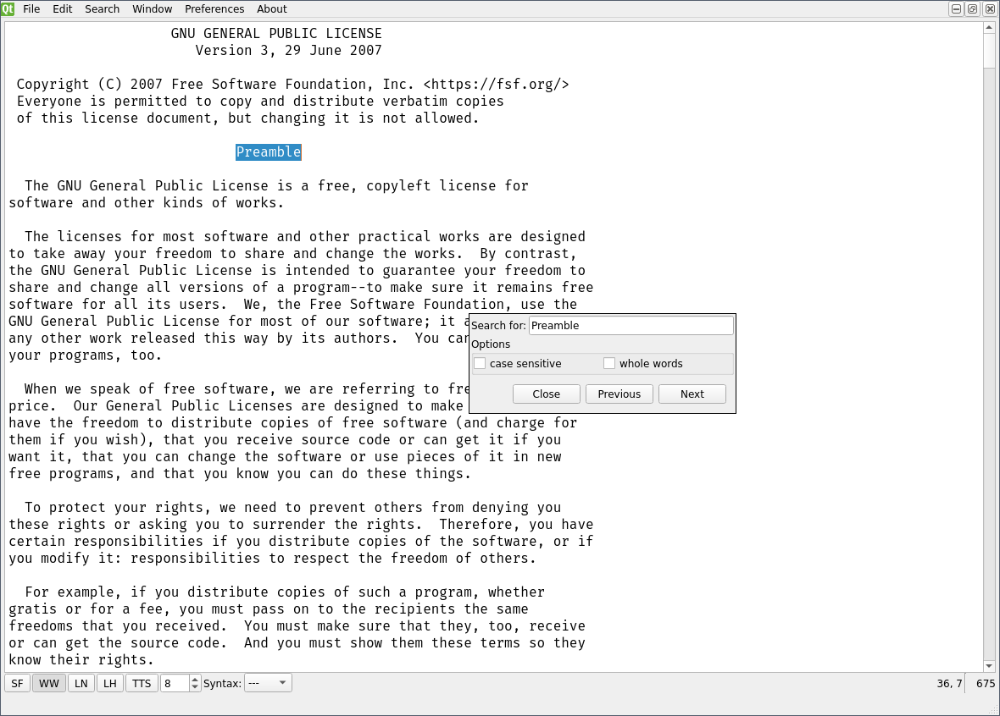
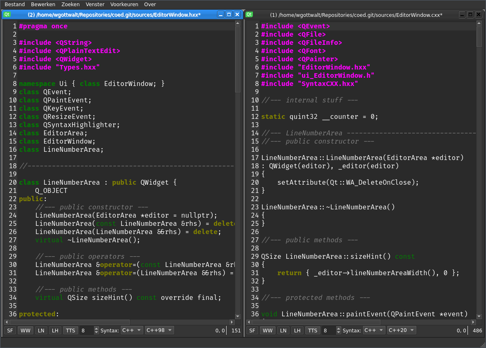

This is a Qt and Linux based code editor. The idea is to demonstrate how a code
editor with instant language switching, themes and syntax highlighting can be
made by using Qt 5 components. To ease building/compilation cmake is used.

I tried to keep the code simple and small, but it is far from perfect. The
structure is a bit messed up. There is no good separation between functionality
and GUI elements now. But I tried to stick to some useful techniques.

This code editor project shows how to do instant language translations, theme
switching and syntax highlighting by using the quite amazing (but bloated)
features of Qt. Most of it is highly asynchronous (read threaded) which can give
a nice speed boost but also make it hard to follow the code. I also created the
project that way, that all additional files like images or language files are
compiled into the code editor binary. In the end there is only the binary and
the need for the Qt 5 Core, Gui and Widget libs (and of course c/c++ runtimes
and X11 Libs on Linux).

The project is still in progress, so some stuff may not work like intended and
some of the language files are incomplete. (I could use some help with the
translations.) English should be complete, and some more are nearly complete.

I also use some additional free components:
- Oxygen icon pack (LGPL-3)
- Mozilla Fira Fonts (Code and Monospace, SIL OPEN FONT LICENSE 1.1)

The requirements are quite simple:
- Linux (can be easily changed to support MacOS/Windows)
- Qt 5.10+ (Core, Gui, Widgets)
- a C++17 capable compiler (gcc 9)
- cmake 3.0

How to build:
- cmake .
- make

cmake provides a clean target so "make clean" works, but there is no distclean
target. In that case the is the distclean.sh script in the scripts directory.
Just run "./scripts/Distclean.sh" after a "make clean" to achieve the distclean
effect.

Screenshots

